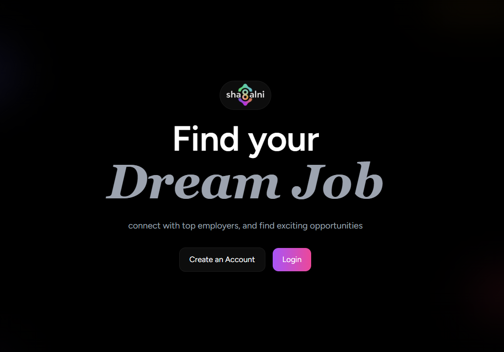
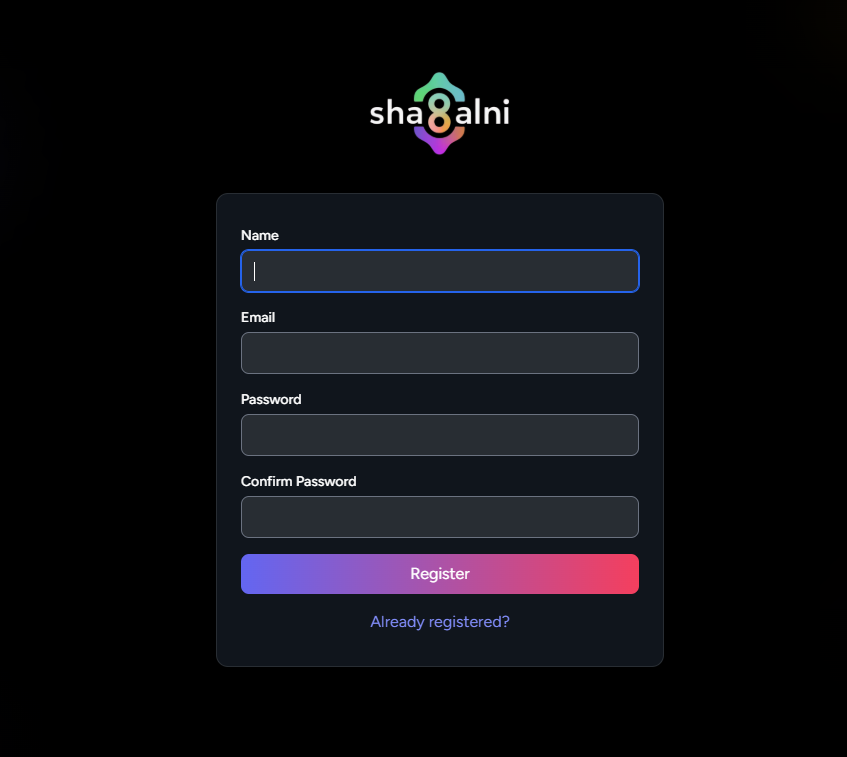
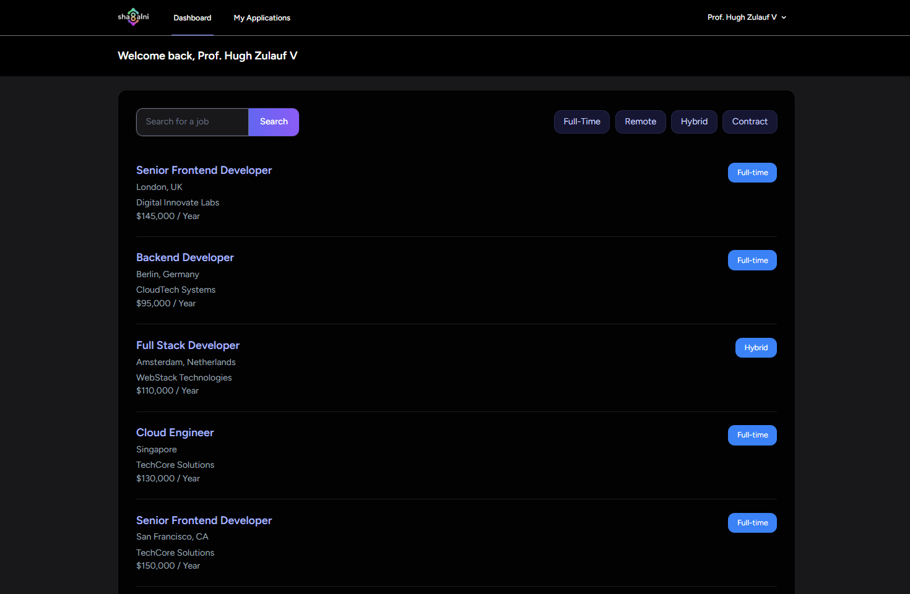
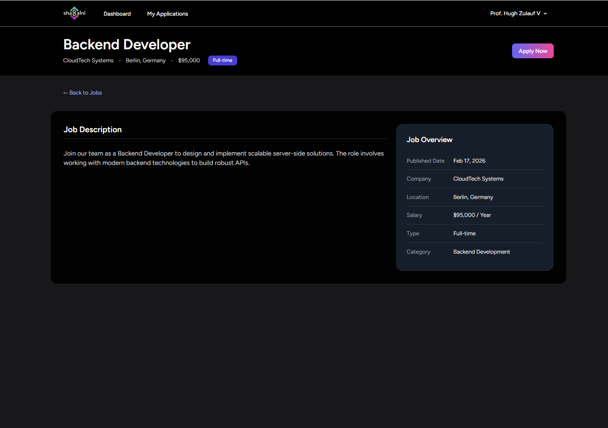
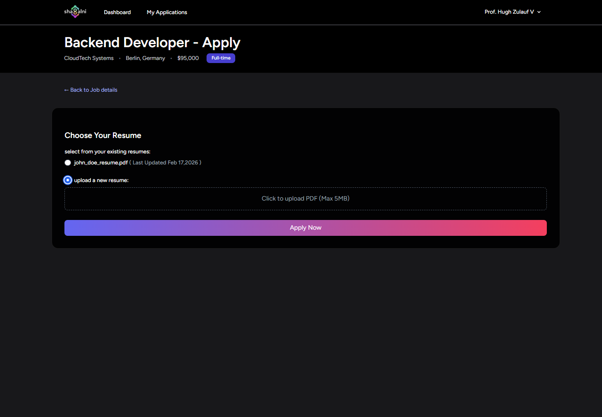
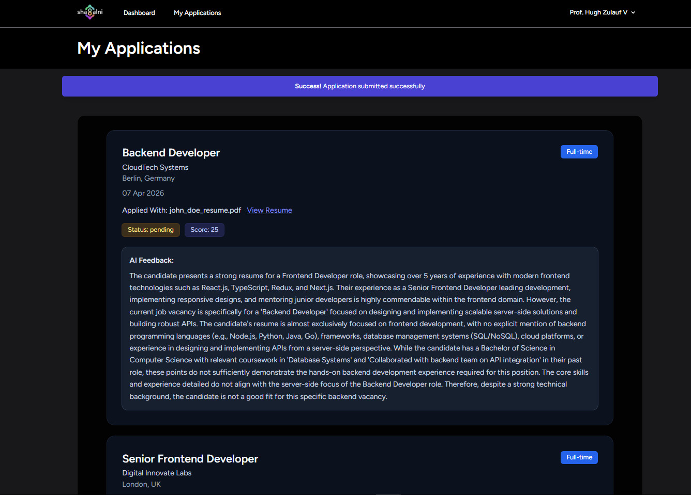

  

# 🤖 AI-Powered Job Portal

A modern recruitment platform that connects companies with job seekers, featuring intelligent CV analysis and candidate evaluation using AI.

---

##  Features

- User authentication and secure login system  
- Fully responsive design across all devices  
- Job listing with advanced search functionality  
- Easy job application process for candidates  
- AI-powered CV parsing and data extraction  
- Candidate suitability scoring based on job requirements  
- Clean and user-friendly interface  

---

##  Tech Stack

- Laravel  
- PHP  
- Blade  
- Alpine.js  
- MariaDB  
- Gemini API  
- Tailwind CSS  
- Docker  
- Laravel Cloud  
- HTML5  

---

##  Installation

1. Clone the repository:  
   git clone https://github.com/ahmedibra24/job_app_sha8lni.git  

2. Navigate to project folder:  
   cd ai-job-portal  

3. Install dependencies:  
   composer install  
   npm install  

4. Setup environment file:  
   cp .env.example .env  

5. Configure database and API keys in `.env` file  

6. Run migrations:  
   php artisan migrate  

7. Generate application key:  
   php artisan key:generate  

8. Run development server:  
   php artisan serve  

9. Compile assets:  
   npm run dev  

10. Open in browser:  
    http://localhost:8000  

---

##  Usage

- Users can register and log in  
- Browse and search for jobs  
- Apply for jobs بسهولة  
- Upload CV for AI analysis  
- View AI-based evaluation and matching score  

---

##  Screenshots

- Home  
  

- Login
  

- Register
  

- All Jobs
  

- Job Details
  

- Apply Job 
  

- My Applications 
  

---

##  Challenges Solved

- Automating CV data extraction using AI  
- Evaluating candidate-job fit efficiently  
- Designing a scalable job listing and search system  
- Ensuring seamless user experience across all devices  

---

##  Future Improvements

- Real-time notifications  
- Email alerts for job applications  
- Advanced filtering and recommendations  
- Multi-language support  
- Integration with external job APIs  

---